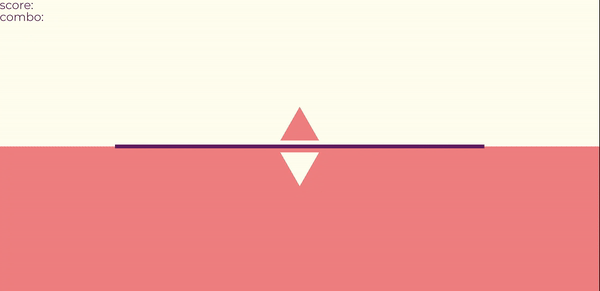

# rhy-game

## 설명

"자신만의 웹 기반 리듬게임을 쉽게 만들어보세요!"

대부분의 리듬게임은 디자인과 개성을 제외하고 공통된 기능들을 가지고 있습니다. rhy-game을 사용하면, 자신만의 리듬게임을 쉽게 만들 수 있습니다. 또한, 웹 기반이기 때문에, 큰 용량을 필요로 하지 않으며 많은 사람들이 당신의 게임을 즐길 수 있을 것입니다.

### 기능

- 노트 기반의 리듬게임을 쉽게 만들기
- HTML DOM을 리듬게임 객체에 연결하기
- 당신은 CSS를 이용하여 디자인만 하면 됩니다!
- 온라인으로 커스텀 채보를 만들기
- 다양한 옵션들로 개성 있는 리듬게임 만들기
- 자신만의 노트와 판정 만들기

### 만들 수 없는 것들

#### 노트 기반이 아닌 리듬게임

- [A Dance of Fire and Ice](https://store.steampowered.com/app/977950/A_Dance_of_Fire_and_Ice/)
- [geometry dash](https://www.robtopgames.com/)
- [Just Dance](https://justdancenow.com/)
- [Just Shapes & Beats](https://store.steampowered.com/app/531510/Just_Shapes__Beats/)

#### 노트가 정해진 레인을 따르지 않는 리듬게임

- [osu!](https://osu.ppy.sh/home/)
- [cytus](https://rayark.com/g/cytus/) \
(You can make it similar with a little trick but it would be hard to make slide notes)
- [cytusII](https://rayark.com/g/cytus2/)

## 문서

### 목차

- [다운로드](#다운로드)
- [튜토리얼](#튜토리얼)
- [옵션](#옵션)
- [고급](#고급)
- [디자인 팁](#디자인-팁)
- [예시](#예시)

### 다운로드

```bash
npm i rhy-game
```

typescript를 위해:

```bash
npm i --save-dev @types/rhy-game
```

또는:

```bash
git clone https://github.com/juneekim7/rhy-game.git
```

브라우저에서:

```html
<script src="https://cdn.jsdelivr.net/gh/juneekim7/rhy-game@main/dist/rhy-game.min.js"></script>
```

### 튜토리얼

#### 새로운 게임을 만들고 HTML DOM 연결하기

```js
const myRhythmGame = new Game({
    DOM: {
        lane1: document.getElementsByClassName('lane')[0],
        lane2: document.getElementsByClassName('lane')[1],
        lane3: document.getElementsByClassName('lane')[2],
        lane4: document.getElementsByClassName('lane')[3],

        background: document.getElementById('background'),
        score: document.getElementById('score'),
        judgement: document.getElementById('judgement'),
        combo: document.getElementById('combo')
    },
    keybind: {
        d: 'lane1',
        f: 'lane2',
        j: 'lane3',
        k: 'lane4'
    },
    sizePerBeat: '25vh',
    laneSizeRaio: 4
})
```

#### Design your game elements

```css
.lane {
    width: 100px;
    height: var(--lane-size);
    border: 1px solid black;

    display: inline-block;
}

.note {
    width: 100px;
    height: var(--size);
    background-color: skyblue;

    position: absolute;
    bottom: var(--size);
}

@keyframes move {
    0% { transform: translateY(0); }
    100% { transform: translateY(var(--lane-size)); }
}

@keyframes fade {
    0% { bottom: 0; height: var(--size); }
    100% { bottom: 0; height: 0; }
}
```

--lane-size 와 --size 의 값은 자동으로 할당됩니다.

#### 나만의 채보 만들기

```js
const myOwnSong = new Song({
    info: {
        music: './music/song.mp3',
        title: 'music title',
        
        bpm: 120,
        split: 16
    },
    chart: {
        // | 는 채보 노트를 나눠 제작자의 편의를 위해 존재할 뿐, 아무 기능도 없음
        mode1: [
            {
                lane1: 'nn**|n*n*|****|****|nn**|n*n*|****|****',
                lane2: '**ll|****|llll|llll|**ll|****|llll|llll',
                lane3: '****|ll**|nnnn|llll|****|ll**|****|llll',
                lane4: '*n*n|n*n*|****|****|*n*n|n*n*|****|****'
            },
            {
                lane1: '****|****|llll|llll|****|****|llll|llll',
                lane2: 'n***|n*n*|****|****|n***|n*n*|****|****',
                lane3: '****|n*n*|****|****|****|n*n*|****|****',
                lane4: '****|****|****|llll|****|****|****|llll'
            }
        ]
    }
})
```

#### 게임 플레이

```js
myRhythmGame.play(myOwnSong, 'mode1')
```

#### 결과

<p align="center">
    
</p>

### 옵션

코드에 나와 있는 값들은 예시일 뿐, 기본값이 아닙니다.

#### Game

```js
new Game({
    ... /* 튜토리얼에 나온 필수 파라미터 */,
    // 채보의 글자들을 노트와 바인딩
    notes: {
        n: (expectedTime) => new Tap(expectedTime),
        l: (expectedTime, additionalData) => new Hold(expectedTime, additionalData),
        c: (expectedTime, additionalData) => new MyCustomNote(expectedTime, additionalData)
    }
    judgements: [
        // new Judgement(name, time, scoreRatio, isCombo)
        new Judgement('perfect', 50, 1, true),
        new Judgement('great', 100, 0.5, true),
        new Judgement('bad', 50, 0.3, false)
        // miss 는 자동으로 생성됨
    ],
    maxScore: 1000,
    delay: 500,
    // 0 은 레인의 끝점, 1 은 레인의 시작점
    judgementPosition: 0.2,
    event: {
        input: {
            keydown: (game, laneName) => {
                // 플레이어가 특정 레인에 바인딩된 키를 누를 때 실행할 것
            },
            keyup: (game, laneName) => {
                // 플레이어가 특정 레인에 바인딩된 키를 땔 때 실행할 것
            }
        },
        play: (game, song, mode) => {
            // game.play가 호출될 때 실행할 것
        },
        load: (game, note) => {
            // 노트가 로드될 때 실행할 것
        },
        judge: (game, judgementData, judgedNote) => {
            // 기본값: this.sendJudgeToDOM()
            // judgementData가 변경될 때 실행할 것

            // `중요` 만약 이 메서드를 수정한다면, score, lastJudgement, combo는 game.DOM.score, game.DOM.judgement, game.DOM.combo에 자동으로 업데이트되지 않을 것입니다.
        },
        end: (game, judgementData) => {
            // 게임이 종료되었을 때 실행할 것
        }
    }
```

#### Judgement

```js
// new Judgement(name, time, scoreRatio, isCombo)
new Judgement('perfect', 50, 1, true)
```

#### Song

```js
new Song({
    info: {
        music: './music.mp3',
        title: 'music title',
        artist: 'artist',

        difficulty: {
            easy: 3,
            hard: 5
        },
        volume: 0.6,
        bpm: 120,
        split: 16,
        delay: 0,
        startFrom: 0,

        cover: './cover.png',
        background: './background.png',

        design: {
            // 넣고 싶은 아무 정보
            // 예를 들어, mainColor
        }
    },
    chart: {
        easy: {
            ...
        },
        hard: {
            ...
        }
    }
})
```

#### Note

```js
// new Note(expectedTime, noteDOMParams)
// 또는
// new Note(expectedTime, additionalData, noteDOMParams)

new Short(100, {
    classNames: ['note', 'short'],
    moveAnimation: 'move',
    fadeAnimation: 'fade',
    timingFunction: 'linear',
    sizeRatio: 0.1
})

new Long(100, {
    lane: 'lane1',
    index: 1,
    timePerBeat: 50
}, {
    classNames: ['note', 'long'],
    moveAnimation: 'move',
    fadeAnimation: 'fade',
    timingFunction: 'linear',
    sizeRatio: 0.1
})
```

### 고급

#### 인스턴스를 생성한 뒤 추가 옵션 설정

```js
const game = new Game(...)
game.event.input.keydown = (game, laneName) => {
    // 플레이어가 특정 레인에 바인딩된 키를 누를 때 실행할 것
}
```

#### 커스텀 노트 만들기

```js
class MyCustomNote extends Note {
    createDOM(laneDOM, moveTime, sizePerBeat, laneSizeRatio) {
        // DOM을 생성하는 메소드
    }

    judge(judgements, eventName, actualTime) {
        if (/* 올바른 조건 */) {
            return Note.prototype.judge.call(this, judgements, eventName, actualTime)
        }
        else if (/* miss 조건 */) {
            return Judgement.miss
        }
        else return 'none'
    }

    constructor(expectedTime, additionalData, {
        classNames,
        moveAnimation,
        fadeAnimation,
        timingFunction,
        sizeRatio
    }) {
        super(
            expectedTime,
            additionalData,
            {
                classNames,
                moveAnimation,
                fadeAnimation,
                timingFunction,
                sizeRatio
            }
        )

        // 알아서
    }
}
```

#### 채보를 제작할 때 도움될만한 것들

beat를 game.play의 세 번째 인자로 넘길 수 있습니다.

```js
const game = new Game()
game.play(song, mode, beat)
// song은 beat 인덱스부터 실행될 것임
```

### 디자인 팁

#### GPU 렌더링을 위해 transition 사용하기

```css
/* 이렇게 하세요 */
@keyframes move {
    0% { transform: translateY(0); }
    100% { transform: translateY(var(--lane-size)); }
}

/* 이렇게 하지 마세요 */
@keyframes move {
    0% { top: 0; }
    100% { top: var(--lane-size); }
}
```

[CSS GPU 애니메이션에 관한 정보](https://www.smashingmagazine.com/2016/12/gpu-animation-doing-it-right/)

#### 노트가 이동하는 거리를 짧게 하기

대부분의 브라우저는 최대 60fps까지만 지원합니다. 만약 노트가 이동하는 거리가 길다면, 부드러운 애니메이션이 적용되지 않을 것입니다.

#### 여러 인스턴스를 생성해 멀티플레이어 게임 만들기

```js
const instance1 = new Game(...)
const instance2 = new Game(...) // 다른 인자

instance1.play(song, mode)
song.info.volume = 0
instance2.play(song, mode)
```

### 예시

#### Normal

<p align="center">
    
</p>

[코드 보기](./examples/games/normal.html)

#### Deltria

<p align="center">
    
</p>

[코드 보기](./examples/games/deltria.html)

#### Quadria

<p align="center">
    
</p>

[코드 보기](./examples/games/quadria.html)

#### Hexios

<p align="center">
    
</p>

[코드 보기](./examples/games/hexios.html)

#### Rytus

<p align="center">
    
</p>

[코드 보기](./examples/games/rytus.html)

#### RTCTC

<p align="center">
    
</p>

[코드 보기](https://github.com/thmchit/rtctc)

## 라이센스

문의 사항은 juneekim7@gmail.com 로 이메일 주세요.

Copyright (c) 2023 준이 (Junee, juneekim7)\
Released under the [MIT License](./LICENSE).
