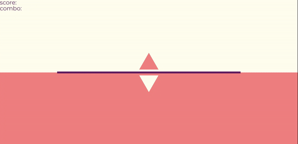
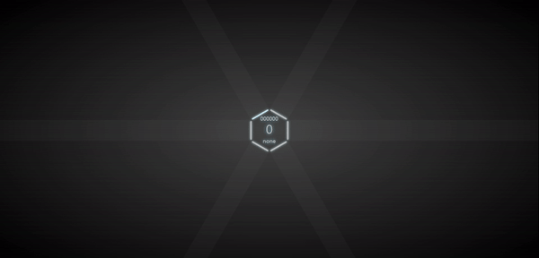
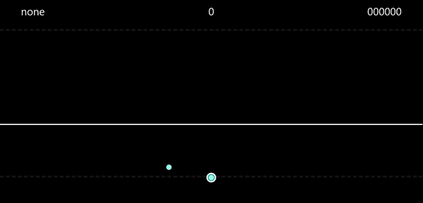

# rhy-game

## Translation

- [한국어](./README.kr.md)

## Description

"Make your own web rhythm game easily!"

Most rhythm games have similar features and mechanism except for design, details, and a bit of personality. With rhy-game, you can make your own note-based web rhythm game. Since your game is on the web, it will be lightweight and accessible to people.

### Features

- make note-based web rhythm game easily
- link HTML DOM elements to rhythm game objects
- all you need to do is design your game with css
- make custom rhythm game map by bmson or load map from online
- custom your rhythm game with many options
- you may also make new notes and judgements

### What cannot be made

#### rhythm game that is not note-based

- [A Dance of Fire and Ice](https://store.steampowered.com/app/977950/A_Dance_of_Fire_and_Ice/)
- [geometry dash](https://www.robtopgames.com/)
- [Just Dance](https://justdancenow.com/)
- [Just Shapes & Beats](https://store.steampowered.com/app/531510/Just_Shapes__Beats/)

#### rhythm game using notes that do not follow designated lanes

- [osu!](https://osu.ppy.sh/home/)
- [cytus](https://rayark.com/g/cytus/) \
(You can make it similar with a little trick but it would be hard to make slide notes)
- [cytusII](https://rayark.com/g/cytus2/)

## Documentation

### Contents

- [Download](#download)
- [Quick Start](#quick-start)
- [Options](#options)
- [Advanced](#advanced)
- [Design Tips](#design-tips)
- [Examples](#examples)

### Download

```bash
npm i rhy-game
```

Or:

```bash
git clone https://github.com/juneekim7/rhy-game.git
```

In the browser:

```html
<script src="https://cdn.jsdelivr.net/gh/juneekim7/rhy-game@main/dist/rhy-game.min.js"></script>
```

As a dependency:

```js
import { Game } from 'rhy-game'
```

```js
const { Game } = require('rhy-game')
```

### Quick Start

#### Make new game and bind HTML DOM elements

```js
const myRhythmGame = new Game({
    DOM: {
        lane1: document.getElementsByClassName('lane')[0],
        lane2: document.getElementsByClassName('lane')[1],
        lane3: document.getElementsByClassName('lane')[2],
        lane4: document.getElementsByClassName('lane')[3],

        background: document.getElementById('background'),
        score: document.getElementById('score'),
        judgement: document.getElementById('judgement'),
        combo: document.getElementById('combo')
    },
    keybind: {
        d: 'lane1',
        f: 'lane2',
        j: 'lane3',
        k: 'lane4'
    },
    sizePerBeat: '25vh',
    laneSizeRaio: 4
})
```

#### Design your game elements

```css
.lane {
    width: 100px;
    height: var(--lane-size);
    border: 1px solid black;

    display: inline-block;
}

.note {
    width: 100px;
    height: var(--size);
    background-color: skyblue;

    position: absolute;
    bottom: var(--size);
}

@keyframes move {
    0% { transform: translateY(0); }
    100% { transform: translateY(var(--lane-size)); }
}

@keyframes fade {
    0% { bottom: 0; height: var(--size); }
    100% { bottom: 0; height: 0; }
}
```

--lane-size and --size are automatically assigned values.

#### Make your own song(chart)

```js
const myOwnSong = new Song({
    info: {
        music: './music/song.mp3',
        
        bpm: 132,
        split: 16
    },
    chart: {
        // | is only for convenience of dividing beats, and has no role
        mode1: [
            {
                lane1: '|****|***|****|s***|',
                lane2: '|****|***|***s|*s**|',
                lane3: '|****|***|**s*|****|',
                lane4: '|****|***|*s**|****|'
            },
            {
                lane1: '||***s|s***|****|****||***s|s***|****|****||****|**s*|lll*|****||****|**s*|lll*|****||',
                lane2: '||**s*|**s*|s***|****||**s*|**s*|s***|****||****|s***|****|****||****|s***|***s|****||',
                lane3: '||*s**|s***|**s*|s***||*s**|s***|**s*|**s*||**s*|****|****|**s*||**s*|****|****|****||',
                lane4: '||s***|****|s***|**s*||s***|****|s***|s***||s***|****|***s|****||s***|****|****|****||'
            }
        ]
    }
})
```

#### Play game

```js
myRhythmGame.play(myOwnSong, 'mode1')
```

#### Result

<p align="center">
    
</p>

### Options

The values written in the code are examples only, not the default values

#### Game

```js
new Game({
    ... /* Parameters that must be specified */,
    // bind characters in chart
    notes: {
        n: (expectedTime) => new Normal(expectedTime),
        t: (expectedTime) => new Tap(expectedTime), // Normal note with touch event
        l: (expectedTime, additionalData) => new Long(expectedTime, additionalData), 
        h: (expectedTime, additionalData) => new Hold(expectedTime, additionalData), // Long note with touch event
        c: (expectedTime, additionalData) => new MyCustomNote(expectedTime, additionalData)
        /* additionalData {
            laneName,
            lane,
            index,
            timePerBeat
        } */
    }
    judgements: [
        // new Judgement(name, time, scoreRatio, isCombo)
        new Judgement('perfect', 50, 1, true),
        new Judgement('great', 100, 0.5, true),
        new Judgement('bad', 50, 0.3, false)
        // miss is automatically generated
    ],
    maxScore: 1000,
    delay: 500,
    // 0 is the end point of the lane, and 1 is the start point of the lane
    judgementPosition: 0.2,
    event: {
        input: {
            keydown: (game, laneName) => {
                // something you want to execute when the player presses down a key which is bound to a specific lane
            },
            keyup: (game, laneName) => {
                // something you want to execute when the player presses up a key which is bound to a specific lane
            }
        },
        play: (game, song, mode) => {
            // something you want to execute when game.play() is called
        },
        load: (game, note) => {
            // something you want to execute when notes are loaded
        },
        judge: (game, judgementData, judgedNote) => {
            // default value: this.sendJudgeToDOM()
            // something you want to execute when judgementData is changed

            // `IMPORTANT` If you define this method as your own, score, lastJudgement, and combo would not automatically displayed in game.DOM.score, game.DOM.judgement, and game.DOM.combo
        },
        end: (game, judgementData) => {
            // something you want to execute when the game is ended
        }
    }
```

#### Judgement

```js
// new Judgement(name, time, scoreRatio, isCombo)
new Judgement('perfect', 50, 1, true)
```

#### Song

```js
new Song({
    info: {
        music: './music.mp3',
        title: 'music title',
        artist: 'artist',

        difficulty: {
            easy: 3,
            hard: 5
        },
        volume: 0.6,
        bpm: 120,
        split: 16,
        delay: 0,
        startFrom: 0,

        cover: './cover.png',
        background: './background.png',

        design: {
            // Anything you want
            // For example, mainColor
        }
    },
    chart: {
        easy: {
            ...
        },
        hard: {
            ...
        }
    }
})
```

#### Note

```js
// new Note(expectedTime, noteDOMParams)
// or
// new Note(expectedTime, additionalData, noteDOMParams)

new Short(100, {
    classNames: ['note', 'short'],
    moveAnimation: 'move',
    fadeAnimation: 'fade',
    timingFunction: 'linear',
    sizeRatio: 0.1
})

new Long(100, {
    lane: 'lane1',
    index: 1,
    timePerBeat: 50
}, {
    classNames: ['note', 'long'],
    moveAnimation: 'move',
    fadeAnimation: 'fade',
    timingFunction: 'linear',
    sizeRatio: 0.1
})
```

### Advanced

#### Assign additional game options after creating an instance 

```js
const game = new Game(...)
game.event.input.keydown = (game, laneName) => {
    // something you want to execute when the player presses down a key which is bound to a specific lane
}
```

#### Make your own custom Notes

```js
class MyCustomNote extends Note {
    createDOM(laneDOM, moveTime, sizePerBeat, laneSizeRatio) {
        // method that creates DOM
    }

    judge(judgements, eventName, actualTime) {
        if (/* right condition */) {
            return Note.prototype.judge.call(this, judgements, eventName, actualTime)
        }
        else if (/* miss condition */) {
            return Judgement.miss
        }
        else return 'none'
    }

    constructor(expectedTime, /* additionalData, */ {
        classNames,
        moveAnimation,
        fadeAnimation,
        timingFunction,
        sizeRatio
    }) {
        super(
            expectedTime,
            {
                classNames,
                moveAnimation,
                fadeAnimation,
                timingFunction,
                sizeRatio
            }
        )

        // anything you want
    }
}
```

#### Things to help with making charts

you can pass beat as third argument of game.play

```js
const game = new Game()
game.play(song, mode, beat)
// the song would be played starting from beat
```

### Design Tips

#### Use transition for GPU render

```css
/* use */
@keyframes move {
    0% { transform: translateY(0); }
    100% { transform: translateY(var(--lane-size)); }
}

/* DO NOT use */
@keyframes move {
    0% { top: 0; }
    100% { top: var(--lane-size); }
}
```

[Information about CSS GPU animation](https://www.smashingmagazine.com/2016/12/gpu-animation-doing-it-right/)

#### Shorten the distance the note moves

Most browsers only support up to 60 fps. If the distance the note moves is long, the animation would not be smooth.

#### Use multiple game instances to make multiplayer rhythm game

```js
const instance1 = new Game(...)
const instance2 = new Game(...) // with different args

instance1.play(song, mode)
song.info.volume = 0
instance2.play(song, mode)
```

### Examples

#### Riano tiles

<p align="center">
    
</p>

[view code](./examples/games/riano%20tiles.html)

#### Deltria

<p align="center">
    
</p>

[view code](./examples/games/deltria.html)

#### Quadria

<p align="center">
    
</p>

[view code](./examples/games/quadria.html)

#### Hexios

<p align="center">
    
</p>

[view code](./examples/games/hexios.html)

#### Rytus

<p align="center">
    
</p>

[view code](./examples/games/rytus.html)

#### RTCTC

<p align="center">
    
</p>

[view code](https://github.com/thmchit/rtctc)

## License

For inquiries, please contact juneekim7@gmail.com

Copyright (c) 2023 준이 (Junee, juneekim7)\
Released under the [MIT License](./LICENSE).
